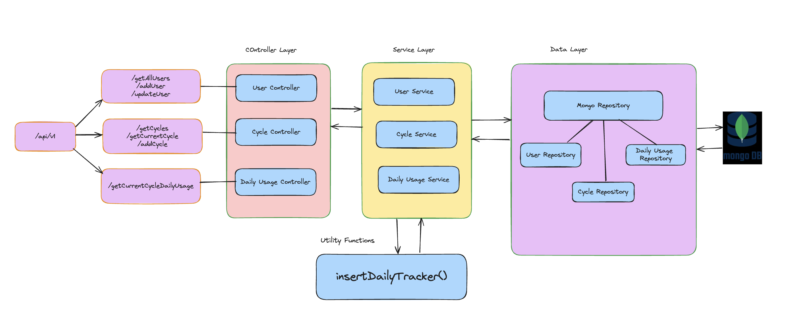

# US Mobile App

[](https://github.com/aditya4196/us-mobile-service/actions/workflows/docker-image.yml)

This is a [Spring Boot](http://projects.spring.io/spring-boot/) microservice which consists of crucial endpoints with respect to Users Registration, Billing Cycle Subscription and Retrieving Daily Usage Statistics

### Contents

- [Service Architecture](#service-architecture)
- [Requirements](#requirements)
- [Local Installation and Running](#running-the-application-locally)
- [Testing](#running-the-test-framework)
- [Credentials](#credentials)
- [Github CI](#github-ci)

## Service Architecture

There are 3 entities User, Cycle and DailyUsage

MongoDB Schema :-

```
-- User --
id, firstName. lastName, email, password
-- User Indexes --
id, email

-- Cycle --
id, userId, mdn, startDate, endDate
-- Cycle Indexes --
id, (userId, mdn, startDate, endDate)

-- DailyUsage --
id, userId, mdn, usageDate, usedInMb
-- DailyUsage Indexes --
id, (userId, mdn, usageDate)
```

Architecture Service Diagram:-


## Requirements

For building and running the application you need:

- [JDK 17](https://www.oracle.com/java/technologies/javase/jdk17-archive-downloads.html)
- [Gradle](https://gradle.org/)
- [Spring boot 3.x](https://spring.io/projects/spring-boot)
- [Docker](https://docs.docker.com/get-docker/)

## Running the application locally

1. Run the below gradle task command from the root location to clean and build the project

   ```
   ./gradlew clean build -x test
   ```

2. Run the spring boot application

   ```
   ./gradlew bootRun
   ```

## Running the application on Docker

1. Start the Docker Desktop locally

2. Run the below command at the root location to build the docker image

   ```
   docker build -t us-mobile-service:latest .
   ```

3. Below command to start the container with the generated docker image

   ```
   docker run -d -p 8080:8080 us-mobile-service:latest
   ```

4. In both the above cases, you can access the spring boot application at below url

   ```
   http://localhost:8080
   ```

5. For all APIs testing Collection, please find the `api-documentation-postman.json` present in the root folder of the project which can be imported into Postman

6. For detailed list of all test and main classes and methods, please load the `doc/index.html` (javadocs) file into the browser

## Running the Test Framework

1. Keep the Docker Desktop running on local
2. `src/test/java` contains the all the below JUnit test classes which refers the mongo test container properties in `src/test/resources/application-test.properties`

## Credentials

1. For the mongoURI string, please request the mongoURI.txt from the owner
2. Set the value from the mongoURI.txt file to the below specified property in `src/main/resources/application.properties`

   ```
   spring.application.name=usmobile
   spring.data.mongodb.uri={{Value from mongoURI.txt}}
   spring.data.mongodb.database=usmobile
   ```

## Github CI

## Copyright

Released under the Apache License 2.0. See the [LICENSE](https://github.com/codecentric/springboot-sample-app/blob/master/LICENSE) file.
